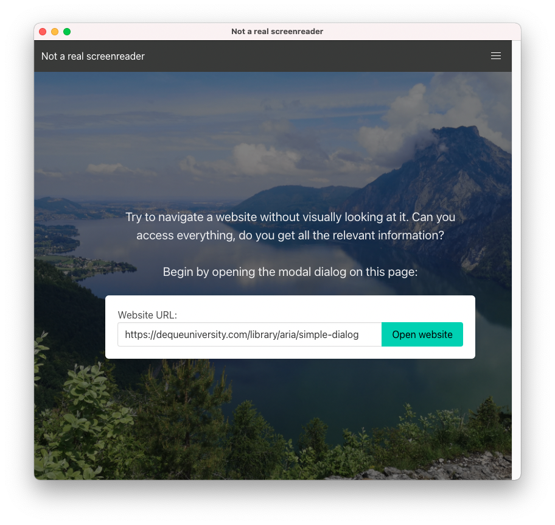
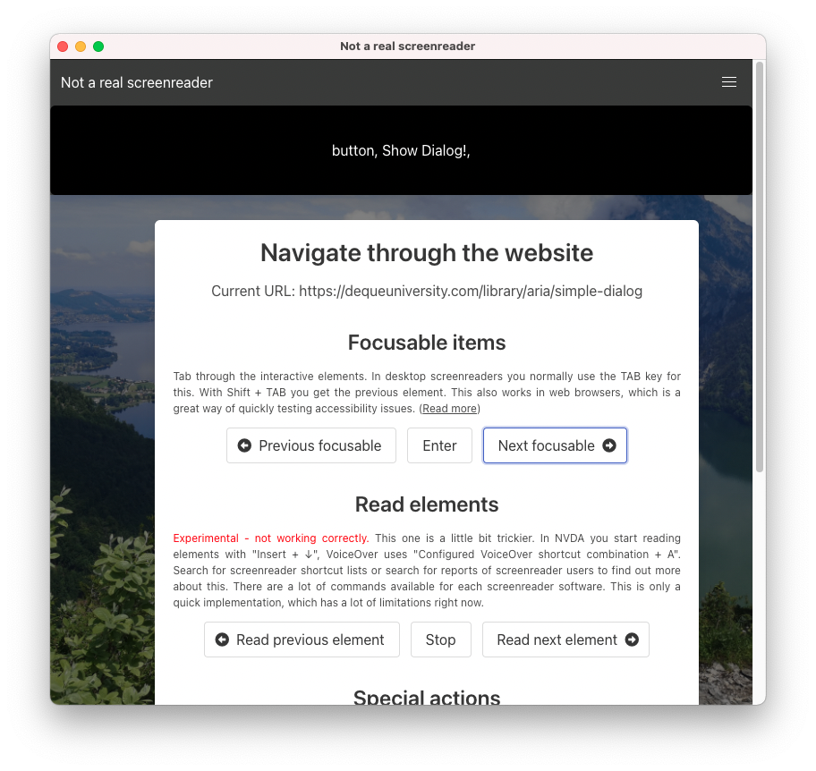

# Not a real screenreader
*Operate a (very simple) screenreader without keyboard shortcuts*

Status: Experimental / Use at your own risk 👷

<p align="center">
  
&nbsp; &nbsp; &nbsp; &nbsp;
  
</p>

## Demo

🎥   Demo video: https://www.youtube.com/watch?v=YJ8tQs6Nz50

## Run

- `npm install`
- `npm start`

Tested with node v14.17.3 (LTS)

## Background story

In last fall I started working as web developer again. Web Accessibility is now part of my daily job, so I needed to learn fast. A big struggle I had at first was operating screenreader software. There are just a lot of keyboard shortcuts to learn while I just wanted to get a basic feeling of how a website is read to screenreader users. Like "Does the screenreader even recognize my button?!".  I'm not sure, but maybe a lot of developers postpone learning a11y skills because of this initial hurdle? (Yes, lame excuse, I know!)

*Not a real screenreader* is an attempt to provide a simple learning and test tool for a11y-beginners. There is no need to learn keyboard shortcuts, the (super simple and basic) screenreader is operated with buttons. 

Disclaimer: I'm an a11y newbie. I try to respect *Nothing About Us Without Us* as much as possible. Feedback is very welcome. :-)

## Open Source tech stack

- electron
- puppeteer
- puppeteer-in-electron
- say, chalk, bulma CSS, etc.

Puppeteer allows accessing the accessibility tree since version 3.0.0. See [accessibility.snapshot()](https://pptr.dev/#?product=Puppeteer&version=v9.1.1&show=api-class-accessibility). Unfortunately there is no DOM-reference given right now. Therefore [this workaround by dtinth](https://github.com/puppeteer/puppeteer/issues/3641#issuecomment-655639166) is used right now in this prototype.

## Current limitations

- does not work with child-Ids currently
- does not support going into subgroups, very basic implementation
- does not check for expanded=true/false yet
- does not support form input (text input) yet
- speech output has no language support, maybe use another library for speech output?
- does not support all focus changes yet
- current URL is not updated on page change
- Problem with minimizing the window on mac
- Not tested on windows/linux yet
- and a lot of other problems 😬

⚠️ Always use a real screenreader for serious accessibility testing! This is just an experimental learning tool for web accessibility. ⚠️

### Example output

```
Current focused element in WebArea: {
  nodeId: '7014',
  ignored: false,
  role: { type: 'role', value: 'button' },
  name: {
    type: 'computedString',
    value: 'JavaScript',
    sources: [ [Object], [Object], [Object], [Object] ]
  },
  properties: [
    { name: 'focusable', value: [Object] },
    { name: 'focused', value: [Object] },
    { name: 'expanded', value: [Object] }
  ],
  childIds: [ '7243' ],
  backendDOMNodeId: 53
} nodeId 7014
```

## License

My own scripts and this work is available as CC0 (https://creativecommons.org/publicdomain/zero/1.0/deed.de). Please see package.json for a list of Open Source Libraries used. I'll provide a LICENSE and CREDITS file in future.